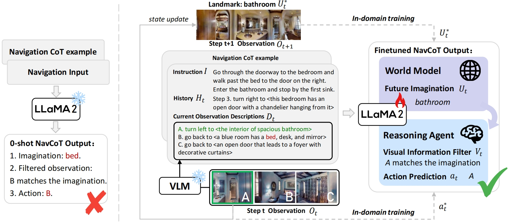

# NavCoT: Boosting LLM-Based Vision-and-Language Navigation  via Learning Disentangled Reasoning

PyTorch implementation of the paper [NavCoT: Boosting LLM-Based Vision-and-Language Navigation via Learning Disentangled Reasoning](https://arxiv.org/abs/2403.07376).

Vision-and-Language Navigation (VLN), as a crucial research problem of Embodied AI, requires an embodied agent to navigate through complex 3D environments following natural language instructions. Recent research has highlighted the promising capacity of large language models (LLMs) in VLN by improving navigational reasoning accuracy and interpretability. However, their predominant use in an offline manner usually suffers from substantial domain gap between the VLN task and the LLM training corpus. This paper introduces a novel strategy called Navigational Chain-of-Thought (NavCoT), where we fulfill parameter-efficient in-domain training to enable self-guided navigational decision, leading to a significant mitigation of the domain gap in a cost-effective manner. Specifically, at each timestep, the LLM is prompted to forecast the navigational chain-of-thought by: 1) acting as a world model to imagine the next observation according to the instruction, 2) selecting the candidate observation that best aligns with the imagination, and 3) determining the action based on the reasoning from the prior steps. Through constructing formalized labels for training, the LLM can learn to generate desired and reasonable chain-of-thought outputs for improving the action decision. Experimental results across various training settings and popular VLN benchmarks (e.g., Room-to-Room (R2R), Room-across-Room (RxR), Room-for-Room (R4R)) show the significant superiority of NavCoT over the direct action prediction variants. Through simple parameter-efficient finetuning, our NavCoT outperforms a recent GPT4-based approach with ~7%  relative improvement on the R2R dataset. We believe that NavCoT will help unlock more task-adaptive and scalable LLM-based embodied agents, which are helpful for developing real-world robotics applications.



## Installation
### Training
The training environment installation of NavCoT follows that in [LLaMA2-Accessory](https://llama2-accessory.readthedocs.io/en/latest/install.html).

Install requirements:
```setup
cd LLaMA2-Accessory
conda create -n accessory python=3.10 -y
conda activate accessory
pip install -r requirements.txt
```

### Testing
The testing environment installation of NavCoT follows that in [VLN-SIG](https://github.com/jialuli-luka/VLN-SIG).

1. Follow instructions [here](https://github.com/clip-vil/CLIP-ViL/tree/master/CLIP-ViL-VLN) to install Matterport3D simulators.
2. Install requirements:
```setup
pip install -r python_requirements.txt
```

## Data Preparation
please follow the instructions below to prepare the data in directories:
### Training
1. Download pretrained LLaMA2 weight from [here](https://huggingface.co/Alpha-VLLM/LLaMA2-Accessory/blob/main/finetune/sg/alpaca_llamaPeft_normBias/consolidated.00-of-01.model.pth).
2. Download tokenizer from [here](https://huggingface.co/Alpha-VLLM/LLaMA2-Accessory/tree/main/config). 
3. Download instruction finetuning data from [here](https://www.dropbox.com/scl/fo/w9uc1pd4w1pxb49nmh6zs/h?rlkey=mewn6i2s50zuf3w9ot2dvmjpp&dl=0).


### Testing
1. Download navigation data following instructions [here](https://github.com/cshizhe/VLN-HAMT).
2. Download pre-trained dVAE from [here](https://github.com/openai/DALL-E).
3. Download pre-extracted CLIP-ViT/16 features and pre-extracted image semantics from [here](https://www.dropbox.com/sh/fftfotbac9878cc/AAD6Al1eRlbm3-lctyoKxWs9a?dl=0).
4. Download RxR English subset from [here](https://www.dropbox.com/scl/fo/ksewnjo3zt27c3fmhmsla/h?rlkey=yng9uj29gyumarbld355f33sy&dl=0)

## Navigation
### Training
```setup
cd LLaMA2-Accessory/accessory/exps/finetune/sg
bash alpaca_llamaPeft_normBias_r2r.sh 0,1,2,3 # (alpaca_llamaPeft_normBias_r4r.sh, alpaca_llamaPeft_normBias_rxr.sh)
```

### Testing
```setup
cd finetune_src
bash scripts/run_r2r.sh # (run_r4r.sh, run_rxr.sh)
```

## Acknowledgement
Some of the codes are built upon [VLN-HAMT](https://github.com/cshizhe/VLN-HAMT), [VLN-SIG](https://github.com/jialuli-luka/VLN-SIG) and [LLaMA 2](https://github.com/Alpha-VLLM/LLaMA2-Accessory). Thanks them for their great works!
